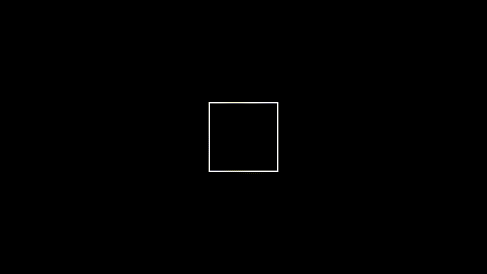
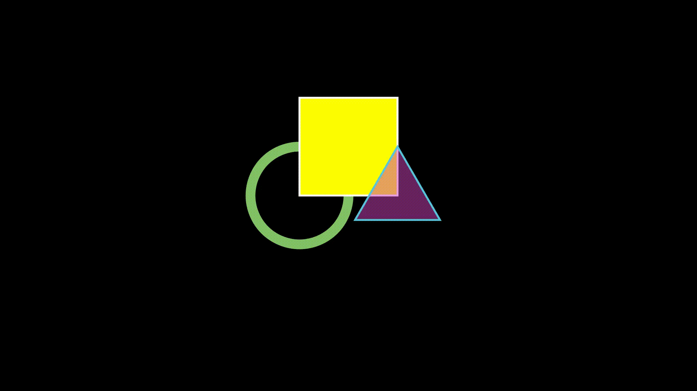

# Programmier-Workshop: Python / Fortgeschrittene


## Create Manim Development Environment

Using Docker, we will setup a development environment on Ubuntu.

Beside of the Dockerfile to create the environment, we will utilise a Makefile to easly build and run the Manim environment.

To build the envrionnment, type:
```make build```

To run the environment, type:
```make run```

### Dockerfile

- use latest Ubuntu Version

- add sudo functionality für user

- set root password

- install latex and additional fonts
  
- install manim and manimlib
## Using Manim

Run the environment by typing ```make run``. 

This starts the docker environment with the local folder ```src```mapped into docker.

```shell
$ make run
docker run  -v ./src:/home/user/src -it manim-ubuntu
user@622fa8e5830a:~$
```

Run some examples

```shell

```
## DOC 110 DEMO.MD

|SquareToCircle|TexTransformExample|MathematicalEquation|MovingAndZoomingCamera|
|:-----:|:-----:|:-----:|:-----:|
|||||

|InteractiveDevelopment|ShapesReplacement|TextExample|PointMovingOnShapes|
|:-----:|:-----:|:-----:|:-----:|
|||||

## DOC 120 REFERENCE.MD

|ThreeDCameraRotation|MovingAngle|ThreeDCameraIllusionRotation|MobjectPlacement|
|:-----:|:-----:|:-----:|:-----:|
|||||

|FixedInFrameMObjectTest|ThreeDSurfacePlot|MovingDots|MovingAround|
|:-----:|:-----:|:-----:|:-----:|
|||||

|MovingGroupToDestination|ArgMinExample|ShowScreenResolution|AnimateExample|
|:-----:|:-----:|:-----:|:-----:|
|||||

|ExampleTransform|RotationUpdater|SquareToCircle2|SquareToCircle3|
|:-----:|:-----:|:-----:|:-----:|
|||||

|FollowingGraphCamera|CoordsToPointExample|ExampleRotation|PointToCoordsExample|
|:-----:|:-----:|:-----:|:-----:|
|||||

|PointWithTrace|LineGraphExample|SquareAndCircle2|LogScalingExample|
|:-----:|:-----:|:-----:|:-----:|
|||||

|AnimatedSquareToCircle2|RunTime|DifferentRotations2|Shapes|
|:-----:|:-----:|:-----:|:-----:|
|||||

|MobjectStyling|Formula1|IterateColor|SineCurveUnitCircle|
|:-----:|:-----:|:-----:|:-----:|
|||||

|OpeningManim|BooleanOperations|MobjectZOrder|PointMovingOnShapes|
|:-----:|:-----:|:-----:|:-----:|
|||||

|CreatingMobjects|SomeAnimations|MovingFrameBox|CreateCircle|
|:-----:|:-----:|:-----:|:-----:|
|||||

## DOC 121 MANIM.MD

|AddToVGroup|Anagram|AnimateChainExample|AnimateExample|
|:-----:|:-----:|:-----:|:-----:|
|||||

|AnimateWithArgsExample|AnimatedBoundaryExample|AnimationOverrideExample|ApplyFuncExample|
|:-----:|:-----:|:-----:|:-----:|
|||||

|ApplyingWaves|ArcBetweenPointsExample|ArcPolygonExample|ArcPolygonExample2|
|:-----:|:-----:|:-----:|:-----:|
|||||

|ArgMinExample|BecomeScene|BraceBPExample|BroadcastExample|
|:-----:|:-----:|:-----:|:-----:|
|||||

|ChangeGraphLayout|ChangeOfDirection|ChangingCameraWidthAndRestore|ChangingZoomScale|
|:-----:|:-----:|:-----:|:-----:|
|||||

|ClockwisePathExample|ComplexValueTrackerExample|ContinuousMotion|CounterclockwisePathExample|
|:-----:|:-----:|:-----:|:-----:|
|||||

|CreateScene|CreateTableExample|CreatingMobjects|CutoutExample|
|:-----:|:-----:|:-----:|:-----:|
|||||

|DarkThemeBanner|DifferentFadeTransforms|DissipatingPathExample|DtUpdater|
|:-----:|:-----:|:-----:|:-----:|
|||||

|EndAnimation|ExampleTransform|ExpandDirections|FadeInExample|
|:-----:|:-----:|:-----:|:-----:|
|||||

|FadeTransformSubmobjects|Fading|FlashOnCircle|GrowArrowExample|
|:-----:|:-----:|:-----:|:-----:|
|||||

|GrowFromCenterExample|GrowFromEdgeExample|GrowFromPointExample|Growing|
|:-----:|:-----:|:-----:|:-----:|
|||||

|HeightExample|Indications|InvertSumobjectsExample|JustifyText|
|:-----:|:-----:|:-----:|:-----:|
|||||

|LagRatios|LightThemeBanner|LineExample|LinearTransformationSceneExample|
|:-----:|:-----:|:-----:|:-----:|
|||||

|MatchPointsScene|MatchingEquationParts|MobjectPlacement|MobjectStyling|
|:-----:|:-----:|:-----:|:-----:|
|||||

|MobjectZOrder|MoveAlongPathExample|MovingAndZoomingCamera|MovingCameraCenter|
|:-----:|:-----:|:-----:|:-----:|
|||||

|MovingCameraOnGraph|MovingDots|MovingGroupToDestination|MovingSquareWithUpdaters|
|:-----:|:-----:|:-----:|:-----:|
|||||

|MovingVertices|MyScene|NextToUpdater|Nudging|
|:-----:|:-----:|:-----:|:-----:|
|||||

|OverrideAnimationExample|PathAlongArcExample|PathAlongCirclesExample|PointCloudDotExample2|
|:-----:|:-----:|:-----:|:-----:|
|||||

|PolygramExample|RateFunctions1Example|RunTime|ScaleVectorFieldFunction|
|:-----:|:-----:|:-----:|:-----:|
|||||

|SeveralArcPolygons|Shapes|ShapesWithVDict|ShowDrawBorderThenFill|
|:-----:|:-----:|:-----:|:-----:|
|||||

|ShowIncreasingSubsetsScene|ShowUncreate|ShowWrite|ShowWriteReversed|
|:-----:|:-----:|:-----:|:-----:|
|||||

|ShuffleSubmobjectsExample|SizingAndSpacing|SomeAnimations|SpinInFromNothingExample|
|:-----:|:-----:|:-----:|:-----:|
|||||

|SpiralPathExample|StraightPathExample|StreamLineCreation|TracedPathExample|
|:-----:|:-----:|:-----:|:-----:|
|||||

|UnwriteReverseFalse|UnwriteReverseTrue|UseZoomedScene|UsingFlash|
|:-----:|:-----:|:-----:|:-----:|
|||||

|UsingFocusOn|UsingIndicate|ValueTrackerExample|VariableExample|
|:-----:|:-----:|:-----:|:-----:|
|||||

## Additional Readings

[Talking Physics - A conversation about teaching and learning physics](https://talkingphysics.wordpress.com/2018/07/13/fields-of-a-moving-charge-manim-series-part-11/)


[readthedocs - manim documentation/examples](https://manimce--458.org.readthedocs.build/en/458/examples.html)


https://financial-engineering.medium.com/manim-examples-3ec2a6e985c5

